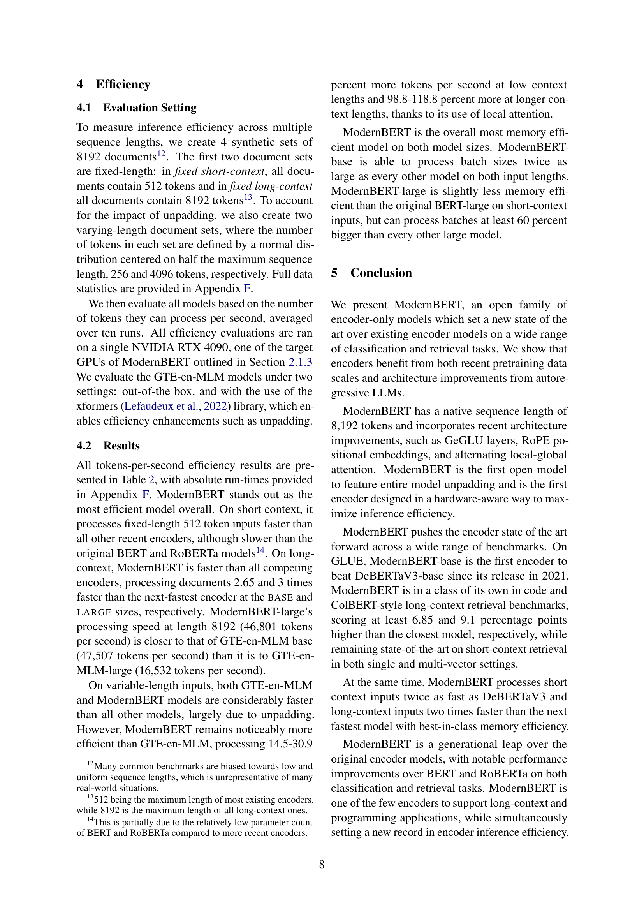

 


 2412.13663 
 Benjamin Warner et el. 
 



↗ arXiv


↗ Hugging Face


↗ Papers with Code


### TL;DR



Encoder-only transformer models like BERT are widely used for tasks such as text classification and retrieval, but improvements have been limited since BERT's release.  Existing models often suffer from limitations in context length (typically 512 tokens), suboptimal architectures, and training data restrictions, hindering performance and efficiency.  These limitations necessitate advancements in encoder models to improve performance on long-context tasks and resource-constrained environments. 

This research introduces ModernBERT, a novel encoder-only model addressing these issues.  **ModernBERT incorporates modern optimizations such as Flash Attention, Rotary Position Embeddings, and GeGLU activations**.  Trained on a massive dataset (2 trillion tokens) with a native 8192 sequence length, **ModernBERT achieves state-of-the-art performance across various benchmarks** encompassing diverse tasks and domains, including code retrieval.  Its high efficiency makes it suitable for deployment on common GPUs, providing a significant leap forward in encoder-only models.



#### Key Takeaways


 ModernBERT significantly improves speed and memory efficiency compared to existing encoder-only models. 



 ModernBERT achieves state-of-the-art results on various NLP tasks, including classification and retrieval, with an extended 8192 token context length. 



 ModernBERT's modular design and released codebase facilitate further research and experimentation in encoder-only models. 


#### Why does it matter?
This paper is important because it presents **ModernBERT**, a significant advancement in encoder-only transformer models.  It addresses limitations of existing models by improving efficiency, expanding context length, and achieving state-of-the-art results on various tasks. This work is relevant to researchers in NLP, IR, and ML, opening avenues for efficient long-context applications and pushing the boundaries of encoder-only model capabilities.  The released codebase and model weights further enhance its impact.

------
#### Visual Insights


|                     | Model     | IR (DPR) BEIR | IR (DPR) MLDROOD | IR (DPR) MLDRID | IR (ColBERT) BEIR | IR (ColBERT) MLDROOD | NLU    | Code GLUE | Code CSN | Code SQA |
| :------------------ | :-------- | :---------------: | :-----------------------: | :-----------------------: | :----------------: | :---------------------------: | :-----: | :--------: | :------: | :------: |
| 

Base

 | BERT      | 38.9             | 23.9                     | 32.2                     | 49.0             | 28.1                         | 84.7   | 41.2      | 59.5     |        |
|                     | RoBERTa   | 37.7             | 22.9                     | 32.8                     | 48.7             | 28.2                         | 86.4   | 44.3      | 59.6     |        |
|                     | DeBERTaV3 | 20.2             | 5.4                      | 13.4                     | 47.1             | 21.9                         | 88.1   | 17.5      | 18.6     |        |
|                     | NomicBERT | 41.0             | 26.7                     | 30.3                     | 49.9             | 61.3                         | 84.0   | 41.6      | 61.4     |        |
|                     | GTE-en-MLM | 41.4             | **34.3**                 | 44.4                     | 48.2             | 69.3                         | 85.6   | 44.9      | 71.4     |        |
|                     | ModernBERT | **41.6**         | 27.4                     | **44.0**                 | **80.2**         | **88.4**                     | **56.4** | **73.6** |          |        |
| 

Large

 | BERT      | 38.9             | 23.3                     | 31.7                     | 49.5             | 28.5                         | 85.2   | 41.6      | 60.8     |        |
|                     | RoBERTa   | 41.4             | 22.6                     | 36.1                     | 49.8             | 28.8                         | 88.9   | 47.3      | 68.1     |        |
|                     | DeBERTaV3 | 25.6             | 7.1                      | 19.2                     | 46.7             | 23.0                         | **91.4** | 21.2      | 19.7     |        |
|                     | GTE-en-MLM | 42.5             | **36.4**                 | **48.9**                 | 50.7             | 71.3                         | 87.6   | 40.5      | 66.9     |        |
|                     | ModernBERT | **44.0**         | 34.3                     | **52.4**                 | **80.4**         | 90.4                         |          | **59.5** | **83.9** |        |

> 🔼 This table presents the performance of various encoder-only models across multiple downstream tasks.  It compares the performance of ModernBERT (the model introduced in the paper) against several established models (BERT, RoBERTa, DeBERTa-v3, NomicBERT, and GTE-en-MLM). The tasks encompass a range of natural language understanding benchmarks (GLUE), code retrieval tasks (CodeSearchNet, StackQA), and text retrieval tasks (BEIR, MLDR).  For text retrieval, the table distinguishes between in-domain (MLDRID, fine-tuned on training data) and out-of-domain (MLDROOD) evaluations.  This allows for a comprehensive comparison of model performance across diverse tasks and data settings.
> 

> 
read the caption

> Table 1: Results for all models across an overview of all tasks. CSN refers to CodeSearchNet and SQA to StackQA. MLDRID refers to in-domain (fine-tuned on the training set) evaluation, and MLDROOD to out-of-domain.
> 

### In-depth insights

#### ModernBERT's Design
ModernBERT's design is a thoughtful blend of established transformer architecture and modern optimization techniques.  **Key improvements** include the use of rotary positional embeddings for better long-context performance, **efficient GeGLU activations** for faster training, and **pre-normalization** for improved stability.  **The adoption of Flash Attention** significantly enhances speed and memory efficiency, especially crucial for processing longer sequences.  Furthermore, the model is designed with **hardware-aware considerations**, optimizing for GPU utilization.  The careful selection of these components, combined with an extensive ablation study, demonstrates a deliberate and effective approach to achieving state-of-the-art performance on a wide array of tasks, addressing both the limitations of previous encoder-only models and the challenges of scaling to larger datasets.

#### Efficiency Gains
The research paper highlights significant efficiency gains in the ModernBERT model, achieved through a combination of architectural improvements and optimized implementation strategies.  **FlashAttention**, a memory and compute efficient attention mechanism, plays a crucial role in reducing both inference time and memory footprint.  Further efficiency is gained from techniques like **unpadding**, which eliminates the need for processing empty padding tokens, resulting in faster processing speeds.  **Architectural optimizations** such as the use of GeGLU activation functions, rotary positional embeddings, and a carefully designed deep and narrow model architecture also contribute to the observed speed and memory improvements.  **GPU-optimized model design** ensures efficient hardware utilization, leading to significant gains in inference speed and throughput. Overall, these strategies synergistically work to produce a highly efficient model, making it suitable for deploying in resource-constrained environments while maintaining state-of-the-art performance on a wide range of tasks.

#### Benchmark Results
A dedicated 'Benchmark Results' section would ideally present a thorough comparison of the proposed model, ModernBERT, against existing state-of-the-art models across various NLP tasks.  This would involve presenting quantitative metrics (e.g., accuracy, F1-score, BLEU score, NDCG@k) for each benchmark dataset.  **Key aspects to highlight would include ModernBERT's performance relative to other encoder-only models**, as well as its comparison to larger, decoder-only models like LLMs, emphasizing its efficiency advantages.  The results should be carefully analyzed to showcase the model's strengths and weaknesses.  **Particular attention should be given to ModernBERT's performance on long-context tasks**,  as this is a major contribution.  A discussion explaining any unexpected results or outliers is necessary.  Ultimately, the benchmark results should convincingly demonstrate ModernBERT's improved performance and efficiency compared to competitors, solidifying its position as a significant advancement in encoder-only models.  Visualizations, such as bar charts or tables, are necessary to effectively communicate the findings.

#### Future Research
Future research directions stemming from this work could explore several promising avenues.  **Extending the model's multilingual capabilities** is crucial, as the current focus on English limits broader applicability.  Investigating the impact of different training objectives, such as incorporating RTD alongside MLM, warrants further study to optimize performance across various downstream tasks.  **Scaling experiments** should explore the effects of increasing model size and parameter count on performance and efficiency, pushing the boundaries of encoder-only model capabilities.  Finally, a **thorough investigation into the phenomenon observed in long-context retrieval** is essential.  The unexpected performance gap between ModernBERT and GTE-en-MLM in out-of-domain scenarios suggests underlying factors that require deeper analysis and potential architectural refinements.  This would involve focusing on aspects like the interaction between local and global attention and the model's adaptation to various data distributions and contexts.

#### Study Limitations
The study's limitations section would critically examine the scope and generalizability of the research findings.  **Language limitations** would be a major point, acknowledging the focus on English and the potential for different results in other languages, particularly resource-constrained ones.  The reliance on web data for training raises concerns about inherent **biases** and the presence of harmful content.  The methodology's use of a masked language modeling (MLM) objective as the sole training approach warrants attention, as it might limit the model's ability to excel in certain tasks, especially those needing generation or other capabilities.  **Scaling limitations** in terms of data size and model parameters need to be addressed.   The study could also mention limitations arising from specific datasets used, potential overfitting, and the need for future research to expand the findings to different domains and tasks.

### More visual insights

More on tables


| MLDROOD |

> 🔼 This table presents a comprehensive comparison of the memory usage and inference speed of various encoder-only models.  The results were obtained using an NVIDIA RTX 4090 GPU, averaging over 10 runs for each model.  Memory efficiency is represented by the maximum batch size (BS) that can be processed. Inference speed is measured in thousands of tokens processed per second.  The table also indicates where configurations were not supported.
> 

> 
read the caption

> Table 2: Memory (max batch size, BS) and Inference (in thousands of tokens per second) efficiency results on an NVIDIA RTX 4090, averaged over 10 runs. Dashes indicate unsupported configurations.
> 


| MLDRID|
|---|---|
> 🔼 This table details the hyperparameters and settings used during the training of the ModernBERT models.  It breaks down the training process into phases (pretraining, context extension phase one and two) for both the base and large versions of the model.  For each phase and model size, the table specifies training tokens, maximum sequence length, batch size, warmup tokens, learning rate, schedule type, total and training time, model initialization method, and dropout rates for different model layers.
> 

> 
read the caption

> Table 3: ModernBERT training settings. Dropout and below are shared across all phases.
> 


| GLUE |
|---|---|
> 🔼 This table details the specific architectural design choices made for the two ModernBERT models: base and large.  It covers key hyperparameters and design decisions impacting performance and efficiency, such as the number of layers, hidden size, activation functions (GeLU), attention mechanisms (global and local), normalization type (LayerNorm), and the use of rotary positional embeddings (RoPE).  It also specifies the presence or absence of bias terms and other implementation details crucial to understanding the model's construction and the reasoning behind those choices.
> 

> 
read the caption

> Table 4: ModernBERT model design
> 


| CSN |
|---|---|
> 🔼 This table presents the results of several encoder-only models on the GLUE benchmark, a widely used evaluation suite for natural language understanding tasks.  The results are broken down by model size (base and large), showing performance on various subtasks within the GLUE benchmark such as single sentence tasks (COLA, SST-2), paraphrase and similarity tasks (MRPC, STS-B, QQP), and natural language inference tasks (MNLI, QNLI, RTE).  Note that results for some models (indicated by Greek letters) were obtained from other papers and included for comparison.
> 

> 
read the caption

> Table 5: GLUE Wang et al. (2018) dev set scores. α taken from Table 8 of Liu et al. (2019a), β taken from Table S3 of Portes et al. (2023), γ from Table 2 of Nussbaum et al. (2024), δ from Table 21 of Zhang et al. (2024), ϵ from Table 2 of Qiang et al. (2024) and ζ from Table 3 of He et al. (2023)
> 


| SQA |
|---|---|
> 🔼 This table shows the hyperparameters used for fine-tuning the ModernBERT model on the GLUE benchmark.  It lists the learning rate (LR), weight decay (WD), and number of epochs (Ep) used for each of the GLUE tasks.  The values were determined through hyperparameter searches to optimize performance on each specific task within the GLUE benchmark.
> 

> 
read the caption

> Table 6: Fine-tuning hyperparameters for ModernBERT on GLUE tasks. LR: Learning Rate, WD: Weight Decay, Ep: Epochs.
> 


|       |       | Params      | BS           | Fixed    | Variable | BS           | Fixed    | Variable |
| :---- | :---- | :---------- | :----------- | :-------- | :-------- | :----------- | :-------- | :-------- |
|       |       |             | Short        |           |           | Long        |           |           |
|       | Model |             |              |           |           |              |           |           |
| Base  | BERT  | 110M        | 1096         | **180.4** | 90.2      | –           | –         | –         |
|       | RoBERTa | 125M        | 664          | 179.9     | 89.9      | –           | –         | –         |
|       | DeBERTaV3 | 183M        | 236          | 70.2      | 35.1      | –           | –         | –         |
|       | NomicBERT | 137M        | 588          | 117.1     | 58.5      | 36          | 46.1      | 23.1      |
|       | GTE-en-MLM | 137M        | 640          | 123.7     | 61.8      | 38          | 46.8      | 23.4      |
|       | GTE-en-MLMxformers | 137M        | 640          | 122.5     | 128.6     | 38          | 47.5      | 67.3      |
|       | ModernBERT | 149M        | **1604**     | 148.1     | **147.3** | **98**      | **123.7** | **133.8** |
| Large | BERT  | 330M        | **792**      | **54.4**  | 27.2      | –           | –         | –         |
|       | RoBERTa | 355M        | 460          | 42.0      | 21.0      | –           | –         | –         |
|       | DeBERTaV3 | 434M        | 134          | 24.6      | 12.3      | –           | –         | –         |
|       | GTE-en-MLM | 435M        | 472          | 38.7      | 19.3      | 28          | 16.2      | 8.1       |
|       | GTE-en-MLMxformers | 435M        | 472          | 38.5      | 40.4      | 28          | 16.5      | 22.8      |
|       | ModernBERT | 395M        | 770          | 52.3      | **52.9**  | **48**      | **46.8**  | **49.8** |
> 🔼 This table presents the performance of various single-vector retrieval models on the BEIR benchmark (Thakur et al., 2021).  The BEIR benchmark is a comprehensive evaluation suite for information retrieval, encompassing a wide variety of tasks and domains. The nDCG@10 metric is used to assess the ranking quality of the retrieved documents for each dataset within BEIR.  Lower nDCG@10 scores suggest poorer retrieval performance.
> 

> 
read the caption

> Table 7: BEIR Thakur et al. (2021) nDCG@10 scores for single-vector retrieval models.
> 


|                     | Pretraining Phase | Pretraining Phase | Context Extension: Phase One | Context Extension: Phase One | Context Extension: Phase Two | Context Extension: Phase Two |
| :------------------ | :----------------- | :----------------- | :-------------------------- | :-------------------------- | :-------------------------- | :-------------------------- |
|                     | Base               | Large              | Base                         | Large                         | Base                         | Large                         |
| Training Tokens      | 1.719 trillion      |                     | 250 billion                   |                     | 50 billion                    |                     |
| Max Sequence Length | 1,024              |                     | 8,192                        |                     | 8,192                        |                     |
| Batch Size          | 4,608              | 4,928              | 72                           | 77                           | 72                           | 78                           |
| Warmup (tokens)     | 50 billion          | 10 billion          | -                            | -                            | -                            | -                            |
| Microbatch Size     | 96                 | 56                 | 12                           | 7                            | 12                           | 6                            |
| Learning Rate       | 8e-4                | 5e-4, 5e-5          | 3e-4                         | 5e-5                         | 3e-4                         | 5e-5                         |
| Schedule            | Trapezoidal         |                     | -                            | -                            | 1-sqrt                       |                     |
| Warmup (tokens)     | 3 billion           | 2 billion           | -                            | -                            | -                            | -                            |
| Decay (tokens)      | -                  | -                  | -                            | -                            | 50 billion                   |                     |
| Weight Decay        | 1e-5                | 1e-5, 1e-6          | 1e-5                         | 1e-6                         | 1e-5                         | 1e-6                         |
| Total Time (hours)  | 194.2               | 425.3               | 39.9                         | 80.7                         | 11.5                         | 21.7                         |
| Training Time (hours)| 191.1               | 420.4               | 36.3                         | 75.1                         | 7.5                          | 15.3                         |
| Model Initialization | Megatron            | From Base           | -                            | -                            | -                            | -                            |
| Dropout (attn out)  | 0.1                 |                     |                     |                     |                     |                     |
| Dropout (all other layers)| 0.0                 |                     |                     |                     |                     |                     |
| Optimizer           | StableAdamW          |                     |                     |                     |                     |                     |
| Betas                | (0.90, 0.98)        |                     |                     |                     |                     |                     |
| Epsilon              | 1e-06               |                     |                     |                     |                     |                     |
| Training Hardware   | 8x H100              |                     |                     |                     |                     |                     |
| Training Strategy   | Distributed DataParallel|                     |                     |                     |                     |                     |
| Software Libraries  | PyTorch 2.4.0, Cuda 12.4.0, Composer 0.24.1, Flash Attention 2.6.3, FA3 commit 32792d3 |                     |                     |                     |                     |                     |
> 🔼 This table presents the performance of various encoder models on the BEIR benchmark's multi-vector retrieval task, specifically measuring the normalized discounted cumulative gain (nDCG) at cutoff 10 (nDCG@10).  The BEIR benchmark is a widely used standard evaluation suite for information retrieval tasks, covering diverse domains and queries.  The nDCG@10 metric quantifies the ranking quality of the retrieved documents.  The table shows how effectively each model can retrieve relevant documents given a query using a multi-vector representation technique (where each document is represented by multiple vectors instead of a single vector).
> 

> 
read the caption

> Table 8: BEIR Thakur et al. (2021) nDCG@10 scores for multi-vector retrieval models.
> 


| Feature | Base | Large |
|---|---|---|
| Vocabulary | 50,368 | 50,368 |
| Unused Tokens | 83 | 83 |
| Layers | 22 | 28 |
| Hidden Size | 768 | 1024 |
| Transformer Block | Pre-Norm | Pre-Norm |
| Activation Function | GeLU | GeLU |
| Linear Bias | False | False |
| Attention | Multi-head | Multi-head |
| Attention Heads | 12 | 16 |
| Global Attention | Every three layers | Every three layers |
| Local Attention Window | 128 | 128 |
| Intermediate Size | 1,152 | 2,624 |
| GLU Expansion | 2,304 | 5,248 |
| Normalization | LayerNorm | LayerNorm |
| Norm Epsilon | 1e-5 | 1e-5 |
| Norm Bias | False | False |
| RoPE theta | 160,000 | 160,000 |
| Local Attn RoPE theta | 10,000 | 10,000 |
> 🔼 This table shows the optimal learning rates used for fine-tuning different encoder models on the BEIR benchmark.  It breaks down the results by two retrieval methods: single-vector and multi-vector retrieval.  The table helps demonstrate the different hyperparameter settings needed to achieve optimal performance for various models in different retrieval scenarios.
> 

> 
read the caption

> Table 9: Learning rate used for reported results on BEIR Thakur et al. (2021) for both single and multi vector retrieval
> 


|                     | Model             | Params | Seq. | CoLA | SST-2 | MRPC | STS-B | QQP  | MNLI | QNLI | RTE |
| :------------------ | :----------------- | :----- | :---- | :---- | :----- | :---- | :----- | :---- | :---- | :---- | :---- |
| **Base**           | BERTβ     | 110M   | 512   | 59.0  | 93.1   | 89.5  | 89.4   | 91.4  | 85.4  | 91.6  | 78.2 |
|                     | RoBERTaα   | 125M   | 512   | 63.6  | 94.8   | 90.2  | 91.2   | 91.9  | 87.6  | 92.8  | 78.7 |
|                     | DeBERTav3ϵ | 183M   | 512   | **69.2** | 95.6   | 89.5  | 91.6   | **92.4** | **90.0** | 83.8  |       |
|                     | MosaicBERT-128β | 137M   | 128   | 58.2  | 93.5   | 89.0  | 90.3   | 92.0  | 85.6  | 91.4  | 83.0 |
|                     | NomicBERT-2048γ | 137M   | 2048  | 50.0  | 93.0   | 88.0  | 90.0   | 92.0  | 86.0  | 92.0  | 82.0 |
|                     | GTE-en-MLMδ | 137M   | 8192  | 57.0  | 93.4   | 92.1  | 88.8   | 86.7  | 91.9  | 84.8  |       |
|                     | ModernBERT         | 149M   | 8192  | **96.0** | **92.2** | **91.8** | 92.1   | 89.1  | **93.9** | **87.4** |       |
| **Large**          | BERTβ     | 330M   | 512   | 56.2  | 93.3   | 87.8  | 90.6   | 90.9  | 86.3  | 92.8  | 83.8 |
|                     | RoBERTaα   | 355M   | 512   | 68.0  | 96.4   | 90.9  | 92.2   | 90.2  | 94.7  | 86.6  |       |
|                     | DeBERTav3ζ | 434M   | 512   | **75.3** | 96.9   | 92.2  | **93.3** | **91.8** | **96.0** | **92.7** |       |
|                     | GTE-en-MLMδ | 434M   | 8192  | 60.4  | **93.5** | 91.4  | 89.2   | 89.2  | **93.9** | 88.1  |       |
|                     | ModernBERT         | 395M   | 8192  | **97.1** | 91.7   | 92.8  | 92.7   | 90.8  | 95.2  | 92.1  |
> 🔼 This table presents statistics of four synthetic datasets created for evaluating the inference efficiency of different models.  Each dataset contains 8192 documents, but differs in the distribution of token lengths within each document.  The first two datasets, 'Fixed Short' and 'Fixed Long', have uniform token lengths of 512 and 8192 tokens per document, respectively.  The other two, 'Variable Short' and 'Variable Long', feature token lengths that follow a normal distribution centered at 256 and 4096 tokens, respectively, to simulate real-world scenarios where document lengths vary.
> 

> 
read the caption

> Table 10: Token statistics for the synthetic datasets used in efficiency evaluations.
> 


Task|Base LR|Base WD|Base Ep|Large LR|Large WD|Large Ep
---|---|---|---|---|---|---
CoLA|8e-5|1e-6|5|3e-5|8e-6|5
MNLI|5e-5|5e-6|1|3e-5|1e-5|1
MRPC|5e-5|5e-6|10|8e-5|5e-6|2
QNLI|8e-5|5e-6|2|3e-5|5e-6|2
QQP|5e-5|5e-6|10|5e-5|8e-6|2
RTE|5e-5|1e-5|3|5e-5|8e-6|3
SST-2|8e-5|1e-5|2|1e-5|1e-6|3
STSB|8e-5|5e-6|10|8e-5|1e-5|10
> 🔼 This table presents the inference speed (tokens per second) of different encoder-only models, including ModernBERT, on various sequence lengths.  The results are broken down by model size (base and large), batch size (fixed and variable-length sequences), and sequence length (short and long).  Bold values indicate the fastest inference speed within two standard deviations of the best result for that category.
> 

> 
read the caption

> Table 11: Inference runtime for all models. Bold indicates the best for the column within two SDs.
> 

### Full paper



